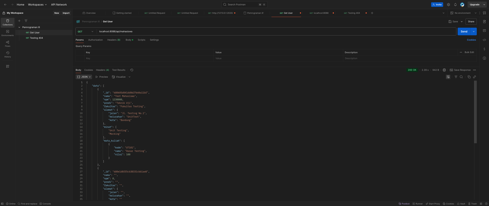
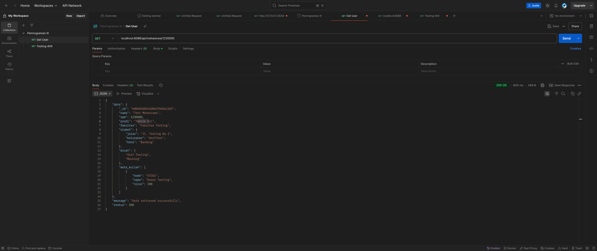
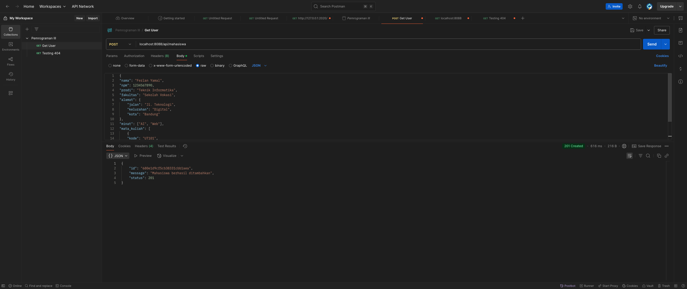
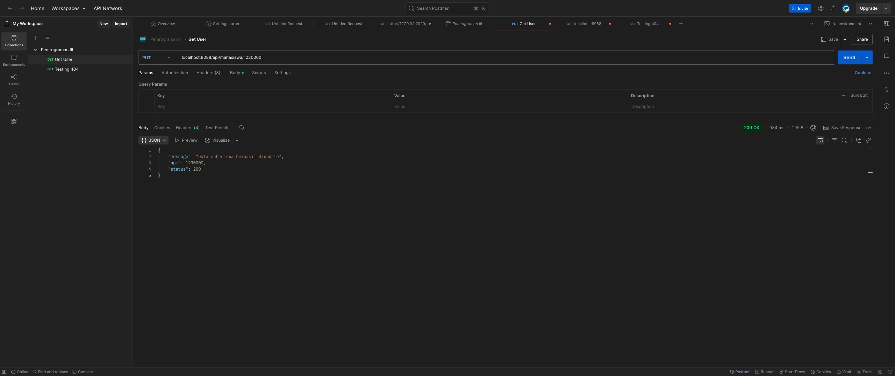
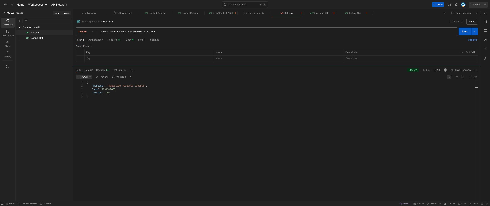

# Dokumentasi Praktikum

## Hasil API dengan Postman

Berikut adalah hasil dari pengujian API menggunakan Postman. 

### 1. **getAllMahasiswa**
Menampilkan semua data mahasiswa yang ada di database.

---

### 2. **getMahasiswaByNPM**
Menampilkan data mahasiswa berdasarkan NPM tertentu.

---

### 3. **insertMahasiswa**
Menambahkan data mahasiswa baru ke dalam database.

---

### 4. **updateMahasiswa**
Memperbarui data mahasiswa yang sudah ada berdasarkan NPM.

---

### 5. **deleteMahasiswa**
Menghapus data mahasiswa berdasarkan NPM.

---

