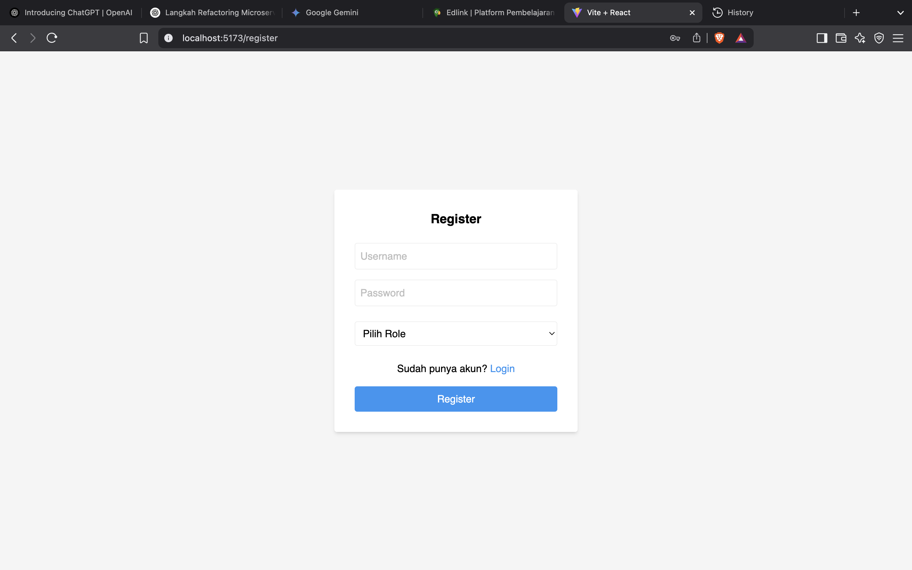

Berikut adalah beberapa langkah untuk menambahkan fitur register pada aplikasi:

### 1. Menambahkan Fungsi Register di `src/service/authService.js`

Tambahkan kode berikut untuk membuat fungsi register:

```js
export const register = async (username, password, role) => {
    const response = await axios.post(`${API_URL}/register`, { username, password, role });
    return response.data;
};
```

**Catatan:**  
Pastikan variabel `API_URL` sudah diubah menjadi:

```js
const API_URL = "http://127.0.0.1:8088";
```

### 2. Membuat Halaman Register di `src/pages/RegisterPage.jsx`

Buat file `RegisterPage.jsx` dengan kode berikut:

```jsx
import { useState, useEffect } from "react";
import { register } from "../service/authService";
import Swal from "sweetalert2";
import { useNavigate } from "react-router-dom";

export function RegisterPage() {
        const [form, setForm] = useState({ username: "", password: "", role: "" });
        const navigate = useNavigate();

        useEffect(() => {
                const token = localStorage.getItem("token");
                if (token) navigate("/dashboard");
        }, [navigate]);

        const handleChange = (e) => {
                const { name, value } = e.target;
                setForm((prev) => ({ ...prev, [name]: value }));
        };

        const handleSubmit = async (e) => {
                e.preventDefault();
                try {
                        await register(form.username, form.password, form.role);
                        Swal.fire("Berhasil", "Registrasi berhasil! Silakan login.", "success");
                        navigate("/");
                } catch (err) {
                        Swal.fire("Gagal", "Registrasi gagal. Username mungkin sudah digunakan.", "error");
                }
        };

        return (
                <div className="min-h-screen flex justify-center items-center bg-gray-100">
                        <form
                                onSubmit={handleSubmit}
                                className="bg-white p-8 rounded shadow-md w-full max-w-sm"
                        >
                                <h2 className="text-xl font-bold mb-6 text-center">Register</h2>
                                <input
                                        type="text"
                                        name="username"
                                        placeholder="Username"
                                        value={form.username}
                                        onChange={handleChange}
                                        className="w-full p-2 mb-4 border rounded"
                                        required
                                />
                                <input
                                        type="password"
                                        name="password"
                                        placeholder="Password"
                                        value={form.password}
                                        onChange={handleChange}
                                        className="w-full p-2 mb-6 border rounded"
                                        required
                                />
                                <select
                                        name="role"
                                        value={form.role || ""}
                                        onChange={handleChange}
                                        className="w-full p-2 mb-6 border rounded"
                                        required
                                >
                                        <option value="" disabled>
                                                Pilih Role
                                        </option>
                                        <option value="admin">Admin</option>
                                        <option value="user">User</option>
                                </select>
                                <div className="mb-4 text-center">
                                        <span>Sudah punya akun? </span>
                                        <button
                                                type="button"
                                                className="text-blue-500 hover:underline"
                                                onClick={() => navigate("/")}
                                        >
                                                Login
                                        </button>
                                </div>
                                <button
                                        type="submit"
                                        className="w-full bg-blue-500 text-white py-2 rounded hover:bg-blue-600"
                                >
                                        Register
                                </button>
                        </form>
                </div>
        );
}
```

### 3. Menambahkan Route Register di `App.jsx`

Tambahkan route berikut setelah route login:

```jsx
<Route path="/register" element={<RegisterPage />} />
```

---

Berikut tampilan halaman register:

